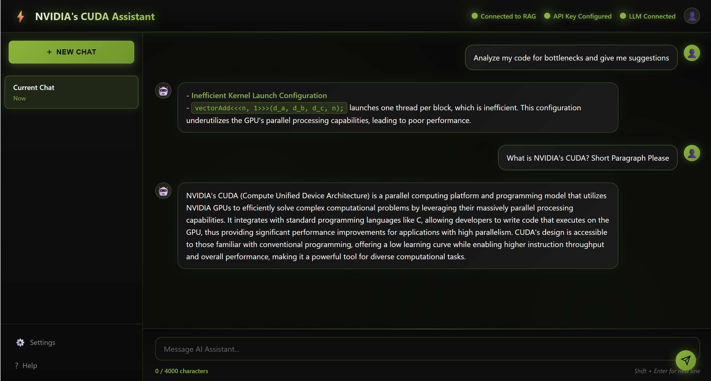

# CUDA Optimization & Benchmarking Agent

A LangGraph-based AI agent that analyzes, optimizes, and benchmarks CUDA `.cu` source files using Retrieval-Augmented Generation (RAG) and conditional workflows. Designed for performance engineers working with NVIDIA CUDA projects.

---

## Demo



## Features

- **RAG-Based Analysis** – Extracts optimization insights using domain-specific CUDA knowledge.
- **Build & Run Benchmarks** – Detects and builds missing `.exe` files before executing performance tests.
- **Output Sanitization** – Cleans and formats LLM responses into user-ready summaries.

---

### Graph Flow

```mermaid
graph TD
    START --> Workflow
    Workflow -->|rag| RAG_Node --> Sanitize --> END
    Workflow -->|analysis| Analysis_Node --> END
    Workflow -->|benchmark| Benchmark_Probe
    Benchmark_Probe -->|0| Build_Benchmark --> Run_Benchmark --> END
    Benchmark_Probe -->|1| Run_Benchmark --> END
